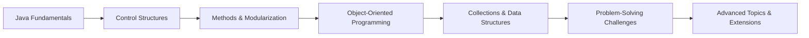

# Java Programming 1  
**From Syntax to Skill: A Real-World Java Learning Journey**

---

## 🚩 What This Repository Is

**Java Programming 1** is a curated, classroom-tested collection of Java practice modules that transforms theory into hands-on coding fluency. This is not a random set of drills—each task is part of a deliberate progression, blending concise explanations with real problem-solving, so you can move beyond memorizing syntax and start building solutions that matter.

---

## 🎯 Why This Exists

Too many learners get stuck at “knowing Java” but never reach “using Java to solve real problems.” This repository was built to close that gap. Every module is designed to help you internalize core concepts, then immediately apply them to challenges inspired by real competitive programming and software development scenarios.

---

## 🛤️ Learning Path Overview


*Start with the basics, build up to OOP, and finish with real-world challenges that demand creative thinking.*

---

## 📚 Topics Covered

- **Java Fundamentals**
  - Variables, Data Types, Input/Output
  - Operators & Expressions
- **Control Flow**
  - Conditionals (if, switch)
  - Loops (for, while, do-while)
- **Methods & Modularization**
  - Defining and Calling Methods
  - Parameter Passing, Return Values
- **Object-Oriented Programming**
  - Classes & Objects
  - Inheritance, Polymorphism, Encapsulation
- **Collections & Data Structures**
  - Arrays, ArrayLists, HashMaps
  - Iterators, Sorting & Searching
- **Problem-Solving & Algorithms**
  - Pattern Recognition
  - Recursion, Greedy, Brute Force
  - Adapted Competitive Programming Tasks
- **Extensions**
  - Exception Handling
  - File I/O
  - Simple Unit Testing

---

## 📝 Practice Task Format

Each task is structured for maximum learning impact:
- **Problem Statement:** Clear, focused, and relevant.
- **Hints:** Strategic nudges, not giveaways.
- **Solution:** Well-commented, idiomatic Java code.
- **Extensions:** Optional twists for deeper exploration.

---

## 🚀 Sample Task Showcase

**Task: Unique Characters in a String**  
*Write a method that checks if a string contains only unique characters.*

<details>
<summary>Hint</summary>
Use a data structure to track seen characters as you iterate.
</details>

```java
public static boolean hasUniqueChars(String input) {
    Set<Character> seen = new HashSet<>();
    for (char c : input.toCharArray()) {
        if (!seen.add(c)) return false;
    }
    return true;
}
```

**Task: Sum of Even Numbers in an Array**  
*Given an array of integers, return the sum of all even numbers.*

```java
public static int sumEven(int[] arr) {
    int sum = 0;
    for (int n : arr) {
        if (n % 2 == 0) sum += n;
    }
    return sum;
}
```

---

## 👥 Who This Is For

- University students and self-learners ready to move beyond textbook examples
- Bootcamp graduates preparing for technical interviews
- Junior developers seeking to solidify their Java foundations through real practice

---

## 🛠️ How to Use the Repo

1. **Clone the repository:**  
   `git clone https://github.com/yourusername/java-programming-1.git`
2. **Open in your favorite IDE:**  
   Recommended: IntelliJ IDEA, Eclipse, or VS Code with Java support.
3. **Java version:**  
   Java 11 or higher is recommended.
4. **Navigate by module:**  
   Each folder represents a learning module. Start at the beginning and progress in order, or jump to topics you want to master.
5. **Run and experiment:**  
   Each task is self-contained. Read the problem, try your own solution, then compare with the provided answer and extensions.

---

## 🤝 Contributing

Contributions are welcome!  
If you have a great task, a clearer explanation, or a new twist on an existing problem, open a pull request. Please keep new tasks focused, well-explained, and aligned with the progressive learning path.

---

## 📝 License & Credits

[MIT License](LICENSE)

Special thanks to the students and mentees whose questions and feedback shaped every module, and to the open-source community for continual inspiration.

---
